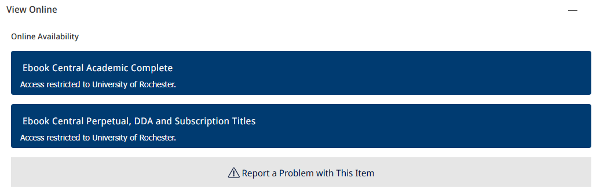
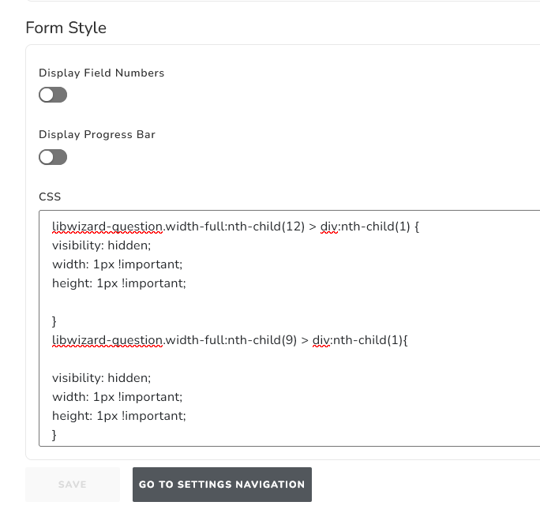

# primo-nde-report-a-problem
A custom "Report a Problem" button that scrapes metadata from the current full-record view and maps it to a Springshare LibWizard form. Inspired by several custom "Report a Problem" buttons for Primo VE and adapted for the NDE.

## Screenshot


## Configuration

1. Setup and configure your local developer environment and follow the instructions on [Ex Libris' customModule Github project page](https://github.com/ExLibrisGroup/customModule).

2. In your IDE, copy the report-aproblem folder to src/app

3. Map selectors to the custom1-module/customComponentMappings.ts file:
```
['nde-view-it-after', ReportAproblemComponent],
['nde-get-it-after', ReportAproblemComponent],
['nde-location-items-container-after', ReportAproblemComponent],
['nde-requests-after', ReportAproblemComponent],
```
[!NOTE]
You can map this component to appear in several places. There is logic built into report-aproblem.component.ts that will deduplicate the button in the Full Record View:
```
    const viewItExists =  document.querySelector('nde-view-it');
    const getItExists =  document.querySelector('nde-get-it');
    const requestsExists = document.querySelector('nde-requests-after-from-remote-0');
    const locationItemsAfterExists = document.querySelector('nde-location-items-container-after-from-remote-0');
    const getItAfterFromRemoteExists = document.querySelector('nde-get-it-after-from-remote-0');

  
    if (viewItExists || locationItemsAfterExists || getItAfterFromRemoteExists ) {
      requestsExists?.remove();
    } 

    if (getItAfterFromRemoteExists) {
      locationItemsAfterExists?.remove();
    }

    if (viewItExists) {
      locationItemsAfterExists?.remove();
      requestsExists?.remove();
    }
```

4. Create a LibWizard form and ensure that the following fields and short names are mapped:
* url
* pnx_title
* pnx_source

[!NOTE]
You can modify your LibWizard form to have other fields and short names, but you will need to modify report-aproblem.component.html and report-aproblem.component.ts accordingly. You can use CSS in LibWizard to hide the url and pnx_source fields from the user for simplification. Use the developer console in your browser to find the CSS selector for the field you want to hide.

```
libwizard-question.width-full:nth-child(9) > div:nth-child(1){

visibility: hidden;
width: 1px !important;
height: 1px !important;
}
```

5. Modify the LibWizard form string in report-aproblem.component.html to match your institution and form ID:
```
<a href="https://<!-- Your Institution -->.libwizard.com/f/<!-- Your Form Name -->?pnx_title={{ openURLTitle }}&pnx_source={{ openURLSource }}&url=https://rochester.primo.exlibrisgroup.com/nde{{ encoded }}" target="_blank">
```

